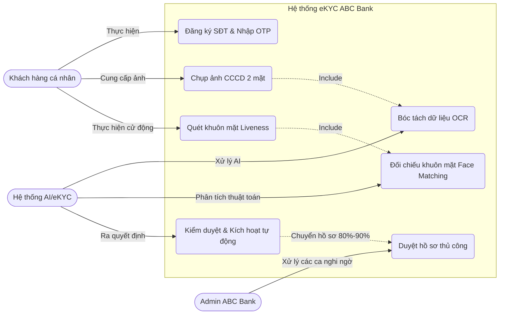

# Tài liệu Software Requirements Specification (SRS)
**Dự án:** Hệ thống định danh khách hàng điện tử (eKYC) - ABC Bank
**Phiên bản:** 1.0

---

## Phần 1: Introduction (Giới thiệu chung)

### 1.1. Purpose (Mục đích tài liệu)
Tài liệu SRS này đặc tả các yêu cầu phần mềm cho phân hệ eKYC thuộc hệ thống Ngân hàng số của ABC Bank. Mục đích của tài liệu là làm cơ sở vững chắc để bàn giao (handover) cho đội ngũ Development (lập trình) và QA (kiểm thử), đảm bảo tất cả các bên hiểu đúng và đủ về scope, logic, cũng như các tiêu chuẩn chất lượng của sản phẩm.

### 1.2. Scope (Phạm vi hệ thống eKYC)
Hệ thống eKYC (Electronic Know Your Customer) của ABC Bank cho phép khách hàng cá nhân tự động định danh trực tuyến thông qua Mobile App mà không cần ra quầy giao dịch. Phạm vi của hệ thống bao gồm: Thu thập số điện thoại đăng ký, thu nhận ảnh giấy tờ tùy thân, ứng dụng trí tuệ nhân tạo để bóc tách thông tin (OCR) và kiểm tra thực thể sống bằng khuôn mặt (Liveness Check).

### 1.3. Definitions, Acronyms (Thuật ngữ)
* **eKYC (Electronic Know Your Customer):** Định danh khách hàng điện tử.
* **OCR (Optical Character Recognition):** Công nghệ nhận dạng ký tự quang học, dùng để đọc và trích xuất thông tin trên thẻ CCCD/CMND.
* **Liveness Check:** Công nghệ kiểm tra thực thể sống nhằm đảm bảo người thực hiện định danh là người thật, chống lại các hình thức giả mạo bằng ảnh chụp, video hoặc mặt nạ.
* **SRS:** Software Requirements Specification (Đặc tả yêu cầu phần mềm).

---

## Phần 2: Overall Description (Mô tả tổng quan)

### 2.1. Product Perspective (Góc nhìn sản phẩm)
Hệ thống eKYC là một microservice cốt lõi nằm trong hệ sinh thái Ngân hàng số của ABC Bank. Nó giao tiếp với Frontend (Mobile App iOS/Android) qua RESTful API và gửi kết quả định danh về hệ thống Core Banking nội bộ để tạo lập CIF (Customer Information File).

### 2.2. User Classes and Characteristics (Đặc điểm người dùng)
* **Khách hàng cá nhân (End User):** Người có smartphone (hệ điều hành iOS/Android) và có kết nối mạng. Đặc điểm: Mong muốn trải nghiệm mượt mà, thao tác ít bước nhất có thể.
* **Quản trị viên (Admin/KYC Officer):** Nhân sự nghiệp vụ của ABC Bank. Đặc điểm: Thành thạo hệ thống web-based, chịu trách nhiệm duyệt lại các hồ sơ bị hệ thống đánh dấu "nghi ngờ" (Manual KYC).

### 2.3. Constraints (Các giới hạn)
* **Luật pháp:** Phải tuân thủ nghiêm ngặt Luật Bảo vệ dữ liệu cá nhân (Nghị định 13/2023/NĐ-CP) và các quy định về chống rửa tiền (AML) của Ngân hàng Nhà nước.
* **Công nghệ:** Hệ thống AI OCR phải đọc được thẻ CCCD có gắn chip, CCCD không gắn chip và CMND cũ 9/12 số của Việt Nam. Camera của khách hàng phải đạt độ phân giải tối thiểu để chụp rõ nét.

---

## Phần 3: Specific Functional Requirements (Yêu cầu chức năng)

### 3.1. Module Đăng ký tài khoản
* **FR-1.1:** Hệ thống yêu cầu người dùng nhập Số điện thoại hợp lệ tại Việt Nam để bắt đầu.
* **FR-1.2:** Hệ thống gửi mã OTP qua tin nhắn SMS đến số điện thoại vừa nhập.
* **FR-1.3:** Người dùng nhập mã OTP để xác thực và tiến hành tạo mã PIN bảo mật 6 số.

### 3.2. Module Upload & Đọc CCCD (OCR)
* **FR-2.1:** App yêu cầu quyền truy cập Camera và hướng dẫn người dùng chụp ảnh mặt trước, mặt sau của CCCD.
* **FR-2.2:** App tự động nhận diện khung viền CCCD và kiểm tra độ sáng, chống lóa trước khi chụp.
* **FR-2.3:** Hệ thống Backend sử dụng OCR để bóc tách các trường: Số CCCD, Họ và Tên, Ngày sinh, Giới tính, Quê quán, Nơi thường trú.
* **FR-2.4:** Hệ thống hiển thị kết quả OCR lên màn hình App để người dùng đối chiếu và chỉnh sửa nếu có sai sót.

### 3.3. Module Xác thực khuôn mặt (Liveness Check)
* **FR-3.1:** Ứng dụng yêu cầu người dùng đưa khuôn mặt vào khung viền hình oval trên màn hình.
* **FR-3.2:** Hệ thống yêu cầu người dùng thực hiện ngẫu nhiên 2 trong 3 hành động: Quay mặt sang trái/phải, Mỉm cười, Nháy mắt (Liveness Check).
* **FR-3.3:** Hệ thống so khớp (Face Matching) ảnh khuôn mặt vừa chụp với ảnh chân dung trên mặt trước CCCD.

### 3.4. Module Kích hoạt tài khoản
* **FR-4.1:** Nếu tỷ lệ so khớp Face Matching >= 90% và không có dấu hiệu giả mạo, hệ thống tự động kích hoạt tài khoản ngay lập tức.
* **FR-4.2:** Nếu tỷ lệ so khớp từ 80% đến dưới 90%, hệ thống đưa hồ sơ vào trạng thái "Chờ duyệt thủ công" (Pending) để Admin ngân hàng xem xét.
* **FR-4.3:** Hệ thống gửi thông báo Push Notification / SMS về kết quả kích hoạt tài khoản cho khách hàng.

---

## Phần 4: Non-Functional Requirements (Yêu cầu phi chức năng)

### 4.1. Security (Bảo mật dữ liệu cá nhân)
* Tồn tại cơ chế mã hóa dữ liệu tại chỗ (Encryption at rest) đối với mọi hình ảnh CCCD và video khuôn mặt của khách hàng.
* Giao tiếp giữa thiết bị di động và máy chủ (Client-Server) bắt buộc phải dùng giao thức HTTPS với chuẩn TLS 1.2 trở lên.
* Che giấu dữ liệu nhạy cảm (Data Masking) khi hiển thị trên Admin Dashboard (ví dụ: che 4 số giữa của CCCD).

### 4.2. Performance (Thời gian phản hồi API)
* Thời gian xử lý ảnh CCCD và trả về kết quả chữ OCR không được vượt quá 3 giây.
* Thời gian xử lý Liveness Check và Face Matching không được vượt quá 2.5 giây trên mạng 4G tiêu chuẩn.

### 4.3. Availability (Tính sẵn sàng)
* Hệ thống eKYC cam kết tỷ lệ hoạt động (Uptime) đạt 99.9%.
* Hệ thống có khả năng tự động mở rộng (Auto-scaling) để đáp ứng tối thiểu 1,000 lượt khách hàng thực hiện định danh cùng một lúc (concurrent users).

---

## Phần 5: Visual Diagram (Sơ đồ trực quan)

Sơ đồ Use Case mô tả luồng thao tác giữa Khách hàng, Hệ thống eKYC và Admin:

